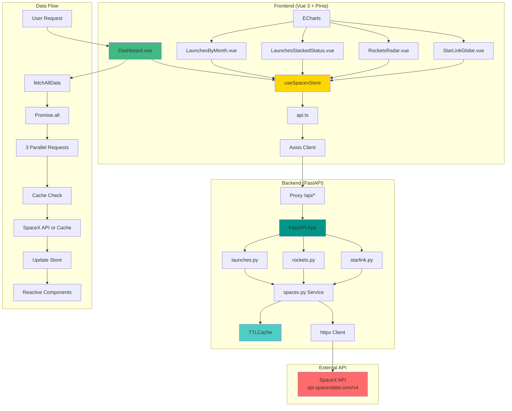

# SpaceX Dashboard

Un dashboard interactivo que muestra datos de SpaceX incluyendo lanzamientos, cohetes y satélites Starlink, con visualizaciones en tiempo real usando Vue 3, TypeScript y ECharts.

## 🚀 Características

- **Dashboard Principal**: Vista general con métricas clave
- **Lanzamientos**: Gráficos de lanzamientos por mes y estado
- **Cohetes**: Visualización radar de características de cohetes
- **Starlink**: Globo 3D interactivo mostrando satélites en órbita
- **Tema Personalizado**: Diseño oscuro con colores vibrantes
- **Responsive**: Funciona en desktop y móvil
- **Cache Inteligente**: Optimización de rendimiento con cache de 10 minutos
- **Estado Global**: Gestión de estado con Pinia

## 🛠️ Tecnologías

### Frontend

- **Vue 3** con Composition API
- **TypeScript** para tipado estático
- **Vite** como bundler
- **Vue Router** para navegación
- **Pinia** para gestión de estado
- **ECharts** para visualizaciones
- **D3.js** para manipulación de datos
- **Axios** para peticiones HTTP

### Backend

- **FastAPI** como framework web
- **Python 3.13+** (requerido)
- **httpx** para peticiones HTTP asíncronas
- **cachetools** para caché con TTL
- **CORS** configurado para desarrollo

## 📋 Prerrequisitos

Antes de comenzar, asegúrate de tener instalado:

- **Node.js** (versión 18 o superior)
- **Python 3.13 o superior** ⚠️ **IMPORTANTE**: Se requiere Python 3.13+ para el correcto funcionamiento del backend
- **npm** o **yarn** (gestor de paquetes de Node.js)
- **pip** (gestor de paquetes de Python)

## 🚀 Instalación y Configuración

### 1. Clonar el repositorio

```bash
git clone <url-del-repositorio>
cd spacex-dashboard
```

### 2. Configurar el Backend

```bash
# Navegar al directorio del backend
cd backend

# Verificar versión de Python (debe ser 3.13+)
python --version

# Crear un entorno virtual (recomendado)
python -m venv venv

# Activar el entorno virtual
# En Windows:
venv\Scripts\activate
# En macOS/Linux:
source venv/bin/activate

# Instalar dependencias
pip install fastapi uvicorn httpx cachetools

# Ejecutar el servidor de desarrollo
uvicorn app.main:app --reload --host 0.0.0.0 --port 8000
```

El backend estará disponible en: `http://localhost:8000`

### 3. Configurar el Frontend

```bash
# En una nueva terminal, navegar al directorio del frontend
cd frontend

# Instalar dependencias
npm install

# Ejecutar el servidor de desarrollo
npm run dev
```

El frontend estará disponible en: `http://localhost:5173`

## 🏗️ Arquitectura del Proyecto

### Flujo de Datos

El proyecto sigue una arquitectura de **Backend for Frontend (BFF)** con las siguientes capas:

1. **Frontend (Vue 3 + Pinia)**: Interfaz de usuario reactiva
2. **Backend (FastAPI)**: API intermedia con cache
3. **SpaceX API**: Fuente de datos externa

### Conexión Frontend-Backend

#### Configuración de Proxy (Vite)
```typescript
// vite.config.ts
export default defineConfig({
  server: {
    proxy: {
      "/api": "http://localhost:8000", // Redirige /api/* al backend
    },
  },
});
```

#### Cliente HTTP (Frontend)
```typescript
// frontend/src/api.ts
export const api = axios.create({ baseURL: "/api" });
export const getLaunches = () => api.get("/launches").then((res) => res.data);
```

#### Endpoints Backend
```python
# backend/app/main.py
app.include_router(launches.router, prefix="/api/launches", tags=["launches"])
app.include_router(rockets.router, prefix="/api/rockets", tags=["rockets"])
app.include_router(starlink.router, prefix="/api/starlink", tags=["starlink"])
```

### Gestión de Estado (Pinia)

#### Store Principal
```typescript
// frontend/src/stores/useSpacexStore.ts
export const useSpacexStore = defineStore("spacex", () => {
  const launches = ref<any[]>([]);
  const rockets = ref<any[]>([]);
  const starlink = ref<any[]>([]);
  
  // Cache individual por tipo de dato
  const lastFetchLaunches = ref<Date | null>(null);
  const lastFetchRockets = ref<Date | null>(null);
  const lastFetchStarlink = ref<Date | null>(null);
  
  // Función para cargar todos los datos
  const fetchAllData = async () => {
    const [launchesData, rocketsData, starlinkData] = await Promise.all([
      getLaunches(), getRockets(), getStarlink()
    ]);
    // Actualizar estado...
  };
});
```

#### Inicialización en Dashboard
```typescript
// frontend/src/views/Dashboard.vue
onMounted(async () => {
  await spacexStore.fetchAllData(); // Carga todos los datos de una vez
});
```

### Cache en Backend

#### Servicio SpaceX
```python
# backend/app/services/spacex.py
from cachetools import TTLCache

cache = TTLCache(maxsize=8, ttl=600)  # Cache de 10 minutos

async def fetch(path: str):
    key = f"spacex:{path}"
    if key in cache:
        return cache[key]  # Retorna datos del cache
    
    # Si no está en cache, hace petición a SpaceX API
    async with httpx.AsyncClient(timeout=15) as client:
        resp = await client.get(f"{BASE}/{path}")
        data = resp.json()
        cache[key] = data  # Guarda en cache
        return data
```

## 📁 Estructura del Proyecto

```
spacex-dashboard/
├── backend/
│   ├── app/
│   │   ├── api/           # Endpoints de la API
│   │   │   ├── launches.py
│   │   │   ├── rockets.py
│   │   │   └── starlink.py
│   │   ├── services/      # Lógica de negocio
│   │   │   └── spacex.py
│   │   └── main.py        # Configuración de FastAPI
│   └── requirements.txt   # Dependencias de Python
├── frontend/
│   ├── src/
│   │   ├── components/    # Componentes Vue
│   │   │   ├── charts/    # Gráficos y visualizaciones
│   │   │   │   ├── LaunchesByMonth.vue
│   │   │   │   ├── LaunchesStackedStatus.vue
│   │   │   │   └── RocketsRadar.vue
│   │   │   ├── layout/    # Layout y navegación
│   │   │   │   ├── AppShell.vue
│   │   │   │   └── Sidebar.vue
│   │   │   └── starlink/   # Componente 3D
│   │   │       └── StarLinkGlobe.vue
│   │   ├── views/          # Páginas principales
│   │   │   ├── Dashboard.vue       # Vista principal
│   │   │   ├── LaunchesRockets.vue
│   │   │   └── StarLink.vue
│   │   ├── stores/         # Estado global (Pinia)
│   │   │   └── useSpacexStore.ts   # Store principal
│   │   ├── assets/         # Recursos estáticos
│   │   │   ├── theme.ts            # Tema personalizado
│   │   │   └── base.css
│   │   ├── router/         # Configuración de rutas
│   │   │   └── index.ts
│   │   ├── api.ts          # Cliente HTTP (Axios)
│   │   ├── main.ts         # Punto de entrada
│   │   └── App.vue         # Componente raíz
│   ├── package.json        # Dependencias de Node.js
│   └── vite.config.ts      # Configuración de Vite + Proxy
└── README.md
```

## 🔧 Scripts Disponibles

### Frontend

```bash
npm run dev      # Servidor de desarrollo
npm run build    # Build para producción
npm run preview  # Preview del build
```

### Backend

```bash
uvicorn app.main:app --reload    # Servidor de desarrollo
uvicorn app.main:app --host 0.0.0.0 --port 8000  # Servidor en puerto específico
```

## 🌐 API Endpoints

### Backend (FastAPI)

| Endpoint | Método | Descripción | Parámetros |
|----------|--------|-------------|------------|
| `/api/launches` | GET | Lista de lanzamientos | `success` (bool), `rocket` (string) |
| `/api/rockets` | GET | Información de cohetes | - |
| `/api/starlink` | GET | Datos de satélites Starlink | - |

### Ejemplos de Uso

```bash
# Obtener todos los lanzamientos
GET http://localhost:8000/api/launches

# Obtener solo lanzamientos exitosos
GET http://localhost:8000/api/launches?success=true

# Obtener lanzamientos de un cohete específico
GET http://localhost:8000/api/launches?rocket=5e9d0d95eda69955f709d1eb
```

## 🎨 Personalización del Tema

El tema se encuentra en `frontend/src/assets/theme.ts` y incluye:

- **Paleta de colores**: 7 colores vibrantes (#ff58b0, #ff83c4, #7c4dff, etc.)
- **Configuración de ECharts**: Estilos para gráficos
- **Colores de texto**: Para diferentes elementos de UI
- **Configuración de grid**: Márgenes y espaciado
- **Tooltips**: Estilos personalizados con blur y bordes redondeados

Para modificar el tema, edita el archivo `theme.ts` y los cambios se aplicarán automáticamente.

## 📊 Flujo de Datos Detallado

### 1. Inicialización
```
Usuario accede a Dashboard → onMounted() → spacexStore.fetchAllData()
```

### 2. Carga de Datos
```
fetchAllData() → Promise.all([
  getLaunches(),    // GET /api/launches
  getRockets(),     // GET /api/rockets  
  getStarlink()     // GET /api/starlink
])
```

### 3. Cache Backend
```
API Request → cache.check() → 
  Si existe: return cache[key]
  Si no existe: SpaceX API → cache[key] = data → return data
```

### 4. Actualización de Componentes
```
Store actualizado → computed properties → watchers → 
updateChart() → ECharts re-render
```

## 🤝 Solución de Problemas

### Error de versión de Python

Si encuentras errores relacionados con la versión de Python:

```bash
# Verificar versión actual
python --version

# Si tienes una versión anterior a 3.13, actualiza Python
# En macOS con Homebrew:
brew install python@3.13

# En Ubuntu/Debian:
sudo apt update
sudo apt install python3.13

# En Windows, descarga desde python.org
```

### Error de CORS

Si encuentras errores de CORS, verifica que el backend esté ejecutándose en el puerto 8000 y el frontend en el puerto 5173.

### Error de dependencias

```bash
# Limpiar caché de npm
npm cache clean --force

# Reinstalar dependencias
rm -rf node_modules package-lock.json
npm install
```

### Error de Python

```bash
# Verificar versión de Python
python --version

# Reinstalar dependencias
pip install --upgrade pip
pip install fastapi uvicorn httpx cachetools
```

## 📊 Datos

Los datos provienen de la [API pública de SpaceX](https://api.spacexdata.com/v4/) y se actualizan automáticamente. El sistema incluye:

- **Caché inteligente**: Reduce las peticiones a la API externa (10 min TTL)
- **Manejo de errores**: Fallbacks cuando la API no está disponible
- **Datos en tiempo real**: Actualización automática cada 10 minutos
- **Filtrado**: Parámetros de query para filtrar lanzamientos

## 🤝 Contribución

1. Fork el proyecto
2. Crea una rama para tu feature (`git checkout -b feature/AmazingFeature`)
3. Commit tus cambios (`git commit -m 'Add some AmazingFeature'`)
4. Push a la rama (`git push origin feature/AmazingFeature`)
5. Abre un Pull Request

## 📝 Licencia

Este proyecto está bajo la Licencia MIT. Ver el archivo `LICENSE` para más detalles.

## 🙏 Agradecimientos

- [SpaceX API](https://api.spacexdata.com/v4/) por proporcionar los datos
- [ECharts](https://echarts.apache.org/) por las visualizaciones
- [Vue.js](https://vuejs.org/) por el framework frontend
- [FastAPI](https://fastapi.tiangolo.com/) por el framework backend

## 🏗️ Diagrama de Arquitectura



### Flujo de Datos Explicado:

1. **Usuario accede al Dashboard** → Se ejecuta `onMounted()`
2. **Store ejecuta fetchAllData()** → Hace 3 peticiones en paralelo
3. **Backend recibe peticiones** → Verifica cache (TTL 10 min)
4. **Si no hay cache** → Hace petición a SpaceX API
5. **Datos se guardan en cache** → Se retornan al frontend
6. **Store actualiza estado** → Componentes se re-renderizan automáticamente
7. **ECharts actualiza gráficos** → Usuario ve datos actualizados

### Beneficios de esta Arquitectura:

- ✅ **Performance**: Cache de 10 minutos reduce llamadas a SpaceX API
- ✅ **UX**: Una sola carga inicial, luego datos instantáneos
- ✅ **Escalabilidad**: Backend puede manejar múltiples frontends
- ✅ **Mantenibilidad**: Separación clara de responsabilidades
- ✅ **Robustez**: Manejo de errores en cada capa
