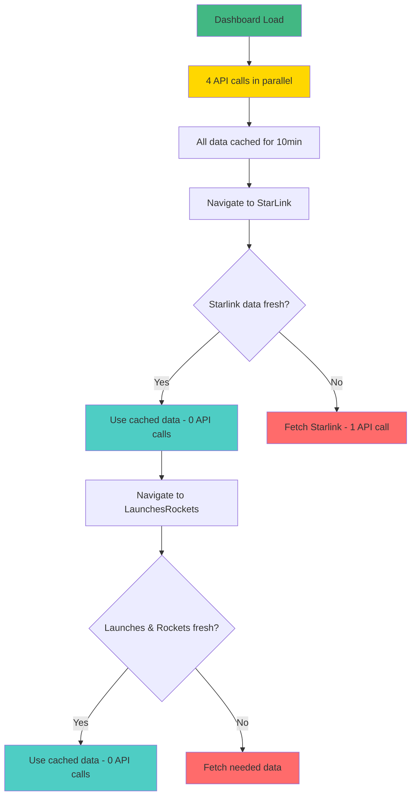
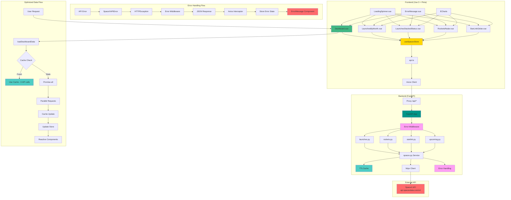

# SpaceX Dashboard

Un dashboard interactivo que muestra datos de SpaceX incluyendo lanzamientos, cohetes y satélites Starlink, con visualizaciones en tiempo real usando Vue 3, TypeScript y ECharts.

## 🚀 Características

- **Dashboard Principal**: Vista general con métricas clave y próximos lanzamientos
- **Lanzamientos**: Gráficos de lanzamientos por mes y estado
- **Cohetes**: Visualización radar de características de cohetes
- **Starlink**: Globo 3D interactivo mostrando satélites en órbita
- **Tema Personalizado**: Diseño oscuro con colores vibrantes estilo SpaceX
- **Responsive**: Funciona en desktop y móvil
- **Cache Inteligente**: Optimización de rendimiento con cache de 10 minutos
- **Estado Global**: Gestión de estado eficiente con Pinia
- **Manejo de Errores**: Sistema robusto de error handling frontend/backend
- **Loading States**: Estados de carga granulares por tipo de dato
- **Navegación Optimizada**: Carga inteligente sin llamadas innecesarias

## 🛠️ Tecnologías

### Frontend

- **Vue 3** con Composition API
- **TypeScript** para tipado estático
- **Vite** como bundler
- **Vue Router** para navegación
- **Pinia** para gestión de estado
- **ECharts** para visualizaciones
- **D3.js** para manipulación de datos
- **Axios** para peticiones HTTP

### Backend

- **FastAPI** como framework web
- **Python 3.13+** (requerido)
- **httpx** para peticiones HTTP asíncronas
- **cachetools** para caché con TTL
- **CORS** configurado para desarrollo
- **Logging** estructurado para debugging
- **Middleware** global de manejo de errores
- **Timeout** configurable (30 segundos)

## 📋 Prerrequisitos

Antes de comenzar, asegúrate de tener instalado:

- **Node.js** (versión 18 o superior)
- **Python 3.13 o superior** ⚠️ **IMPORTANTE**: Se requiere Python 3.13+ para el correcto funcionamiento del backend
- **npm** o **yarn** (gestor de paquetes de Node.js)
- **pip** (gestor de paquetes de Python)

## 🚀 Instalación y Configuración

### 1. Clonar el repositorio

```bash
git clone <url-del-repositorio>
cd spacex-dashboard
```

### 2. Configurar el Backend

```bash
# Navegar al directorio del backend
cd backend

# Verificar versión de Python (debe ser 3.13+)
python --version

# Crear un entorno virtual (recomendado)
python -m venv venv

# Activar el entorno virtual
# En Windows:
venv\Scripts\activate
# En macOS/Linux:
source venv/bin/activate

# Instalar dependencias
pip install -r requirements.txt

# Ejecutar el servidor de desarrollo
uvicorn app.main:app --reload --host 0.0.0.0 --port 8000
```

El backend estará disponible en: `http://localhost:8000`

### 3. Configurar el Frontend

```bash
# En una nueva terminal, navegar al directorio del frontend
cd frontend

# Instalar dependencias
npm install

# Ejecutar el servidor de desarrollo
npm run dev
```

El frontend estará disponible en: `http://localhost:5173`

## 🛡️ Sistema de Manejo de Errores

El proyecto implementa un sistema robusto de manejo de errores tanto en frontend como backend, proporcionando una experiencia de usuario fluida y debugging eficiente.

### 🎨 Componentes de UI para Errores

#### LoadingSpinner.vue

```vue
<!-- Componente de carga con múltiples tamaños y mensajes personalizables -->
<LoadingSpinner :message="loadingMessage" size="large" :full-screen="true" />
```

**Características:**

- ✅ **3 tamaños**: small, medium, large
- ✅ **Modo full-screen** opcional
- ✅ **Mensajes contextuales** por tipo de carga
- ✅ **Animación SpaceX-style** con múltiples anillos
- ✅ **Colores corporativos** (#ffffff, #00d4ff, #ff6b35)

#### ErrorMessage.vue

```vue
<!-- Componente de error con detalles técnicos expandibles -->
<ErrorMessage
  :title="errorTitle"
  :message="errorMessage"
  :details="errorDetails"
  :full-screen="true"
  :show-retry="true"
  @retry="retryLoad"
/>
```

**Características:**

- ✅ **Mensajes amigables** para usuarios
- ✅ **Detalles técnicos** expandibles para developers
- ✅ **Botones de acción** (Reintentar, Recargar página)
- ✅ **Códigos de error** específicos
- ✅ **Timestamps** para tracking

### 🔧 Store de Pinia Mejorado

#### Estados Individuales por Tipo de Dato

```typescript
// Estados de carga granulares
const loadingStates = ref<Record<string, LoadingState>>({
  launches: { isLoading: false, loadingMessage: "Loading launches..." },
  rockets: { isLoading: false, loadingMessage: "Loading rockets..." },
  starlink: {
    isLoading: false,
    loadingMessage: "Loading Starlink satellites...",
  },
  upcomingLaunches: {
    isLoading: false,
    loadingMessage: "Loading upcoming launches...",
  },
});

// Estados de error individuales
const errors = ref<Record<string, ApiError | null>>({
  launches: null,
  rockets: null,
  starlink: null,
  upcomingLaunches: null,
});
```

#### Manejo Inteligente de Errores

```typescript
const createApiError = (err: any, context: string): ApiError => {
  let message = "Unknown error";
  let code = "UNKNOWN_ERROR";

  if (err?.response) {
    // Errores HTTP específicos
    switch (err.response.status) {
      case 400:
        message = "Invalid request";
        break;
      case 404:
        message = "Resource not found";
        break;
      case 429:
        message = "Too many requests. Try again later";
        break;
      case 500:
        message = "Internal server error";
        break;
      // ... más casos
    }
  } else if (err?.request) {
    // Errores de red
    message = "Connection error. Check your internet connection";
    code = "NETWORK_ERROR";
  }

  return {
    message: `${message} (${context})`,
    code,
    details: err.response?.data,
    timestamp: new Date(),
  };
};
```

### 🌐 Interceptores de Axios

#### Manejo Global de Errores HTTP

```typescript
// Interceptor de respuesta con manejo inteligente
api.interceptors.response.use(
  (response) => response,
  (error) => {
    // Manejo específico por código HTTP
    const status = error.response?.status;
    let userMessage = "Unknown error";

    switch (status) {
      case 400:
        userMessage = "Invalid request";
        break;
      case 401:
        userMessage = "Unauthorized";
        break;
      case 403:
        userMessage = "Access denied";
        break;
      case 404:
        userMessage = "Resource not found";
        break;
      case 429:
        userMessage = "Too many requests. Try again later";
        break;
      case 500:
        userMessage = "Internal server error";
        break;
      case 502:
        userMessage = "Service unavailable";
        break;
      case 503:
        userMessage = "Service temporarily unavailable";
        break;
    }

    return Promise.reject({
      ...error,
      message: userMessage,
      code: `HTTP_${status}`,
      originalStatus: status,
      originalData: error.response?.data,
    });
  }
);
```

**Características:**

- ✅ **Timeout de 30 segundos** configurable
- ✅ **Mensajes específicos** por código HTTP
- ✅ **Manejo de errores de red** (sin respuesta del servidor)
- ✅ **Logging automático** de requests y errores
- ✅ **Errores mejorados** con contexto adicional

### 🚀 Backend FastAPI Mejorado

#### Clase SpaceXAPIError Personalizada

```python
class SpaceXAPIError(Exception):
    """Custom exception for SpaceX API errors"""
    def __init__(self, message: str, status_code: int = None, details: dict = None):
        self.message = message
        self.status_code = status_code
        self.details = details or {}
        super().__init__(self.message)
```

#### Manejo Robusto de Errores en Servicios

```python
async def fetch(path: str):
    """Improved function with robust error handling"""
    try:
        async with httpx.AsyncClient(timeout=30.0) as client:
            resp = await client.get(f"{BASE}/{path}")

            if resp.status_code == 200:
                data = resp.json()
                cache[key] = data
                return data
            elif resp.status_code == 404:
                raise SpaceXAPIError(
                    message=f"Resource not found: {path}",
                    status_code=404,
                    details={"path": path, "api_response": resp.text}
                )
            elif resp.status_code == 429:
                raise SpaceXAPIError(
                    message="Too many requests to the SpaceX API. Try again later.",
                    status_code=429,
                    details={"path": path, "retry_after": resp.headers.get("Retry-After")}
                )
            # ... más casos específicos

    except httpx.TimeoutException:
        raise SpaceXAPIError(
            message="Timeout of connection with the SpaceX API",
            status_code=408,
            details={"path": path, "timeout": "30s"}
        )
    except httpx.ConnectError:
        raise SpaceXAPIError(
            message="Error of connection with the SpaceX API",
            status_code=503,
            details={"path": path}
        )
```

#### Middleware Global de Manejo de Errores

```python
@app.middleware("http")
async def error_handling_middleware(request: Request, call_next):
    start_time = time.time()

    try:
        response = await call_next(request)
        # Log de requests exitosos
        process_time = time.time() - start_time
        logger.info(f"Request successful: {request.method} {request.url.path} - {response.status_code} - {process_time:.3f}s")
        return response

    except HTTPException as e:
        # Manejo de HTTPExceptions de FastAPI
        return JSONResponse(
            status_code=e.status_code,
            content={
                "error": True,
                "message": e.detail.get("message", str(e.detail)),
                "details": e.detail.get("details", {}),
                "timestamp": e.detail.get("timestamp", time.time()),
                "path": request.url.path,
                "method": request.method
            }
        )

    except RequestValidationError as e:
        # Manejo de errores de validación
        return JSONResponse(
            status_code=422,
            content={
                "error": True,
                "message": "Error de validación en la solicitud",
                "details": e.errors(),
                "timestamp": time.time(),
                "path": request.url.path,
                "method": request.method
            }
        )

    except Exception as e:
        # Manejo de errores inesperados
        return JSONResponse(
            status_code=500,
            content={
                "error": True,
                "message": "Error interno del servidor",
                "details": {"error": str(e)},
                "timestamp": time.time(),
                "path": request.url.path,
                "method": request.method
            }
        )
```

**Características del Backend:**

- ✅ **Timeout de 30 segundos** para requests a SpaceX API
- ✅ **Manejo específico** de códigos HTTP (404, 429, 5xx)
- ✅ **Rate limiting** inteligente con retry-after
- ✅ **Errores de conexión** y timeout manejados
- ✅ **Logging detallado** con timestamps y performance
- ✅ **Middleware global** que captura todos los errores
- ✅ **Respuestas estructuradas** con contexto completo

### 📱 Integración en Vistas

#### Dashboard.vue con Estados Granulares

```vue
<template>
  <main class="dashboard">
    <!-- Loading State -->
    <div v-if="isAnyLoading" class="loading-container">
      <LoadingSpinner
        :message="loadingMessage"
        size="large"
        :full-screen="true"
      />
    </div>

    <!-- Error State -->
    <div v-else-if="hasAnyError" class="error-container">
      <ErrorMessage
        :title="errorTitle"
        :message="errorMessage"
        :details="errorDetails"
        :full-screen="true"
        :show-retry="true"
        @retry="retryLoad"
      />
    </div>

    <!-- Main Content -->
    <div v-else class="dashboard-content">
      <!-- Contenido del dashboard -->
    </div>
  </main>
</template>

<script setup lang="ts">
// Estados de loading y error mejorados
const isAnyLoading = computed(() => {
  const states = spacexStore.loadingStates;
  return (
    states.launches.isLoading ||
    states.rockets.isLoading ||
    states.starlink.isLoading ||
    states.upcomingLaunches.isLoading
  );
});

const loadingMessage = computed(() => {
  const states = spacexStore.loadingStates;
  if (states.launches.isLoading) return states.launches.loadingMessage;
  if (states.rockets.isLoading) return states.rockets.loadingMessage;
  if (states.starlink.isLoading) return states.starlink.loadingMessage;
  if (states.upcomingLaunches.isLoading)
    return states.upcomingLaunches.loadingMessage;
  return "Loading dashboard data...";
});

const hasAnyError = computed(() => {
  const errors = spacexStore.errors;
  return (
    errors.launches ||
    errors.rockets ||
    errors.starlink ||
    errors.upcomingLaunches
  );
});

const errorTitle = computed(() => {
  const errors = spacexStore.errors;
  if (errors.launches) return "Error loading launches";
  if (errors.rockets) return "Error loading rockets";
  if (errors.starlink) return "Error loading Starlink";
  if (errors.upcomingLaunches) return "Error loading upcoming launches";
  return "Error loading dashboard";
});

const errorMessage = computed(() => {
  const errors = spacexStore.errors;
  if (errors.launches) return errors.launches.message;
  if (errors.rockets) return errors.rockets.message;
  if (errors.starlink) return errors.starlink.message;
  if (errors.upcomingLaunches) return errors.upcomingLaunches.message;
  return "Unknown error";
});

const errorDetails = computed(() => {
  const errors = spacexStore.errors;
  const error =
    errors.launches ||
    errors.rockets ||
    errors.starlink ||
    errors.upcomingLaunches;
  return error ? JSON.stringify(error.details, null, 2) : "";
});
</script>
```

### 🎯 Beneficios del Sistema de Manejo de Errores

#### 1. Experiencia de Usuario Mejorada

- ✅ **Mensajes claros** y amigables en español/inglés
- ✅ **Estados de carga** informativos y contextuales
- ✅ **Opciones de recuperación** (botón reintentar)
- ✅ **Feedback visual** profesional con componentes SpaceX-style

#### 2. Debugging y Mantenimiento

- ✅ **Logging detallado** en backend y frontend
- ✅ **Detalles técnicos** expandibles para developers
- ✅ **Timestamps** para tracking de errores
- ✅ **Códigos de error** específicos y categorizados
- ✅ **Contexto completo** en cada error

#### 3. Robustez del Sistema

- ✅ **Manejo de timeouts** (30 segundos)
- ✅ **Recuperación de errores de red**
- ✅ **Rate limiting** inteligente con retry-after
- ✅ **Fallbacks** apropiados para cada tipo de error
- ✅ **Validación** de requests y responses

#### 4. Performance Optimizada

- ✅ **Estados de carga** granulares por tipo de dato
- ✅ **Cache inteligente** con manejo de errores
- ✅ **Carga paralela** con error handling individual
- ✅ **Navegación fluida** sin interrupciones por errores

## 🧠 Store de Pinia Optimizado

### Cache Inteligente y Carga Eficiente

El store ha sido completamente optimizado para evitar llamadas innecesarias y proporcionar una experiencia de navegación fluida.

#### Estados Individuales por Tipo de Dato

```typescript
// Cache individual con timestamps
const lastFetchLaunches = ref<Date | null>(null);
const lastFetchRockets = ref<Date | null>(null);
const lastFetchStarlink = ref<Date | null>(null);
const lastFetchUpcomingLaunches = ref<Date | null>(null);

const CACHE_DURATION = 10 * 60 * 1000; // 10 minutos

// Computed properties para verificar cache
const isLaunchesOutdated = computed(() => {
  if (!lastFetchLaunches.value) return true;
  return Date.now() - lastFetchLaunches.value.getTime() > CACHE_DURATION;
});
```

#### Funciones Helper Optimizadas

```typescript
// Carga inteligente solo de datos necesarios
const loadDashboardData = async () => {
  const promises = [];

  // Solo cargar si está obsoleto o vacío
  if (isLaunchesOutdated.value || launches.value.length === 0) {
    promises.push(fetchLaunches());
  }
  if (isRocketsOutdated.value || rockets.value.length === 0) {
    promises.push(fetchRockets());
  }
  if (isStarlinkOutdated.value || starlink.value.length === 0) {
    promises.push(fetchStarlink());
  }
  if (isUpcomingLaunchesOutdated.value || upcomingLaunches.value.length === 0) {
    promises.push(fetchUpcomingLaunches());
  }

  if (promises.length > 0) {
    await Promise.all(promises);
  }
};

const loadLaunchesRocketsData = async () => {
  const promises = [];

  if (isLaunchesOutdated.value || launches.value.length === 0) {
    promises.push(fetchLaunches());
  }
  if (isRocketsOutdated.value || rockets.value.length === 0) {
    promises.push(fetchRockets());
  }

  if (promises.length > 0) {
    await Promise.all(promises);
  }
};

const loadStarlinkData = async () => {
  if (isStarlinkOutdated.value || starlink.value.length === 0) {
    await fetchStarlink();
  }
};
```

#### Verificación Doble de Cache

```typescript
const fetchStarlink = async () => {
  // ✅ Verificación 1: Cache de tiempo (10 minutos)
  // ✅ Verificación 2: Datos existen
  if (!isStarlinkOutdated.value && starlink.value.length > 0) {
    return starlink.value; // ❌ NO hace llamada - retorna cache
  }

  // Solo llega aquí si realmente necesita cargar
  setLoading("starlink", true);
  clearError("starlink");

  try {
    const data = await getStarlink();
    starlink.value = data;
    lastFetchStarlink.value = new Date();
    clearError("starlink");
    return data;
  } catch (err) {
    const apiError = createApiError(err, "Starlink satellites");
    setError("starlink", apiError);
    throw apiError;
  } finally {
    setLoading("starlink", false);
  }
};
```

## 🚀 Flujo de Navegación Optimizado

### Escenario Real: Dashboard → StarLink → LaunchesRockets



### Performance Detallada

#### 1. Carga Inicial (Dashboard)

```typescript
// Dashboard carga TODO en paralelo
await Promise.all([
  spacexStore.fetchLaunches(), // ✅ Llama API
  spacexStore.fetchRockets(), // ✅ Llama API
  spacexStore.fetchStarlink(), // ✅ Llama API
  spacexStore.fetchUpcomingLaunches(), // ✅ Llama API
]);
// Total: 4 llamadas API
```

#### 2. Navegación a StarLink.vue

```typescript
// StarLink solo verifica si necesita cargar Starlink
const loadStarlinkData = async () => {
  if (isStarlinkOutdated.value || starlink.value.length === 0) {
    await fetchStarlink(); // ❌ NO se ejecuta - datos ya en cache
  }
};
// Total: 0 llamadas API
```

#### 3. Navegación a LaunchesRockets.vue

```typescript
// LaunchesRockets verifica launches y rockets
const loadLaunchesRocketsData = async () => {
  const promises = [];

  if (isLaunchesOutdated.value || launches.value.length === 0) {
    promises.push(fetchLaunches()); // ❌ NO se ejecuta - datos ya en cache
  }
  if (isRocketsOutdated.value || rockets.value.length === 0) {
    promises.push(fetchRockets()); // ❌ NO se ejecuta - datos ya en cache
  }

  if (promises.length > 0) {
    await Promise.all(promises); // ❌ NO se ejecuta - array vacío
  }
};
// Total: 0 llamadas API
```

### Beneficios del Sistema Optimizado

#### ✅ Performance Máxima

- **Dashboard**: 4 llamadas paralelas (primera carga)
- **StarLink**: 0 llamadas (usa cache)
- **LaunchesRockets**: 0 llamadas (usa cache)
- **Total**: Solo 4 llamadas iniciales

#### ✅ Cache Inteligente

- **Duración**: 10 minutos por tipo de dato
- **Verificación doble**: Tiempo + existencia de datos
- **Granular**: Cada tipo de dato tiene su propio cache

#### ✅ Estados Granulares

- **Loading individual**: Por tipo de dato
- **Error individual**: Por tipo de dato
- **Mensajes contextuales**: Específicos por operación

#### ✅ Experiencia de Usuario

- **Navegación instantánea**: Sin delays innecesarios
- **Estados informativos**: Usuario sabe qué está cargando
- **Recuperación de errores**: Botones de reintentar funcionales

### Verificación en DevTools

Para verificar el comportamiento optimizado:

1. **Abre Network tab** en DevTools
2. **Carga Dashboard** → Verás 4 llamadas API
3. **Navega a StarLink** → NO verás nuevas llamadas
4. **Navega a LaunchesRockets** → NO verás nuevas llamadas
5. **Espera 10+ minutos y navega** → Verás nuevas llamadas (cache expirado)

## 🏗️ Arquitectura del Proyecto

### Flujo de Datos

El proyecto sigue una arquitectura de **Backend for Frontend (BFF)** con las siguientes capas:

1. **Frontend (Vue 3 + Pinia)**: Interfaz de usuario reactiva
2. **Backend (FastAPI)**: API intermedia con cache
3. **SpaceX API**: Fuente de datos externa

### Conexión Frontend-Backend

#### Configuración de Proxy (Vite)

```typescript
// vite.config.ts
export default defineConfig({
  server: {
    proxy: {
      "/api": "http://localhost:8000", // Redirige /api/* al backend
    },
  },
});
```

#### Cliente HTTP (Frontend)

```typescript
// frontend/src/api.ts
export const api = axios.create({ baseURL: "/api" });
export const getLaunches = () => api.get("/launches").then((res) => res.data);
```

#### Endpoints Backend

```python
# backend/app/main.py
app.include_router(launches.router, prefix="/api/launches", tags=["launches"])
app.include_router(rockets.router, prefix="/api/rockets", tags=["rockets"])
app.include_router(starlink.router, prefix="/api/starlink", tags=["starlink"])
```

### Gestión de Estado (Pinia)

#### Store Principal

```typescript
// frontend/src/stores/useSpacexStore.ts
export const useSpacexStore = defineStore("spacex", () => {
  const launches = ref<any[]>([]);
  const rockets = ref<any[]>([]);
  const starlink = ref<any[]>([]);

  // Cache individual por tipo de dato
  const lastFetchLaunches = ref<Date | null>(null);
  const lastFetchRockets = ref<Date | null>(null);
  const lastFetchStarlink = ref<Date | null>(null);

  // Función para cargar todos los datos
  const fetchAllData = async () => {
    const [launchesData, rocketsData, starlinkData] = await Promise.all([
      getLaunches(),
      getRockets(),
      getStarlink(),
    ]);
    // Actualizar estado...
  };
});
```

#### Inicialización en Dashboard

```typescript
// frontend/src/views/Dashboard.vue
onMounted(async () => {
  await spacexStore.fetchAllData(); // Carga todos los datos de una vez
});
```

### Cache en Backend

#### Servicio SpaceX

```python
# backend/app/services/spacex.py
from cachetools import TTLCache

cache = TTLCache(maxsize=8, ttl=600)  # Cache de 10 minutos

async def fetch(path: str):
    key = f"spacex:{path}"
    if key in cache:
        return cache[key]  # Retorna datos del cache

    # Si no está en cache, hace petición a SpaceX API
    async with httpx.AsyncClient(timeout=15) as client:
        resp = await client.get(f"{BASE}/{path}")
        data = resp.json()
        cache[key] = data  # Guarda en cache
        return data
```

## 📁 Estructura del Proyecto

```
spacex-dashboard/
├── backend/
│   ├── app/
│   │   ├── api/           # Endpoints de la API
│   │   │   ├── launches.py
│   │   │   ├── rockets.py
│   │   │   ├── starlink.py
│   │   │   └── upcoming.py
│   │   ├── services/      # Lógica de negocio
│   │   │   └── spacex.py  # Servicio con manejo robusto de errores
│   │   └── main.py        # Configuración de FastAPI + Middleware global
│   └── requirements.txt   # Dependencias de Python
├── frontend/
│   ├── src/
│   │   ├── components/    # Componentes Vue
│   │   │   ├── charts/    # Gráficos y visualizaciones
│   │   │   │   ├── LaunchesByMonth.vue
│   │   │   │   ├── LaunchesStackedStatus.vue
│   │   │   │   └── RocketsRadar.vue
│   │   │   ├── layout/    # Layout y navegación
│   │   │   │   ├── AppShell.vue
│   │   │   │   └── Sidebar.vue
│   │   │   ├── ui/        # Componentes de UI reutilizables
│   │   │   │   ├── LoadingSpinner.vue
│   │   │   │   └── ErrorMessage.vue
│   │   │   ├── cards/     # Componentes de tarjetas
│   │   │   │   └── KPICard.vue
│   │   │   ├── tables/    # Componentes de tablas
│   │   │   │   └── UpcomingLaunchesTable.vue
│   │   │   └── starlink/   # Componente 3D
│   │   │       └── StarLinkGlobe.vue
│   │   ├── views/          # Páginas principales
│   │   │   ├── Dashboard.vue       # Vista principal con error handling
│   │   │   ├── LaunchesRockets.vue # Vista con estados granulares
│   │   │   └── StarLink.vue        # Vista optimizada
│   │   ├── stores/         # Estado global (Pinia)
│   │   │   └── useSpacexStore.ts   # Store optimizado con cache inteligente
│   │   ├── assets/         # Recursos estáticos
│   │   │   ├── theme.ts            # Tema personalizado SpaceX-style
│   │   │   └── base.css
│   │   ├── router/         # Configuración de rutas
│   │   │   └── index.ts
│   │   ├── api.ts          # Cliente HTTP (Axios) con interceptores
│   │   ├── main.ts         # Punto de entrada
│   │   └── App.vue         # Componente raíz
│   ├── package.json        # Dependencias de Node.js
│   └── vite.config.ts      # Configuración de Vite + Proxy
└── README.md
```

## 🔧 Scripts Disponibles

### Frontend

```bash
npm run dev      # Servidor de desarrollo
npm run build    # Build para producción
npm run preview  # Preview del build
```

### Backend

```bash
uvicorn app.main:app --reload    # Servidor de desarrollo
uvicorn app.main:app --host 0.0.0.0 --port 8000  # Servidor en puerto específico
```

## 🌐 API Endpoints

### Backend (FastAPI)

| Endpoint                 | Método | Descripción                 | Parámetros                          |
| ------------------------ | ------ | --------------------------- | ----------------------------------- |
| `/api/launches`          | GET    | Lista de lanzamientos       | `success` (bool), `rocket` (string) |
| `/api/rockets`           | GET    | Información de cohetes      | -                                   |
| `/api/starlink`          | GET    | Datos de satélites Starlink | -                                   |
| `/api/launches/upcoming` | GET    | Próximos lanzamientos       | -                                   |
| `/health`                | GET    | Health check del servicio   | -                                   |

### Ejemplos de Uso

```bash
# Obtener todos los lanzamientos
GET http://localhost:8000/api/launches

# Obtener solo lanzamientos exitosos
GET http://localhost:8000/api/launches?success=true

# Obtener lanzamientos de un cohete específico
GET http://localhost:8000/api/launches?rocket=5e9d0d95eda69955f709d1eb

# Obtener próximos lanzamientos
GET http://localhost:8000/api/launches/upcoming

# Health check
GET http://localhost:8000/health
```

## 🎨 Personalización del Tema

El tema se encuentra en `frontend/src/assets/theme.ts` y incluye:

- **Paleta de colores**: 7 colores vibrantes (#ff58b0, #ff83c4, #7c4dff, etc.)
- **Configuración de ECharts**: Estilos para gráficos
- **Colores de texto**: Para diferentes elementos de UI
- **Configuración de grid**: Márgenes y espaciado
- **Tooltips**: Estilos personalizados con blur y bordes redondeados

Para modificar el tema, edita el archivo `theme.ts` y los cambios se aplicarán automáticamente.

## 📊 Flujo de Datos Detallado

### 1. Inicialización

```
Usuario accede a Dashboard → onMounted() → spacexStore.fetchAllData()
```

### 2. Carga de Datos

```
fetchAllData() → Promise.all([
  getLaunches(),    // GET /api/launches
  getRockets(),     // GET /api/rockets
  getStarlink()     // GET /api/starlink
])
```

### 3. Cache Backend

```
API Request → cache.check() →
  Si existe: return cache[key]
  Si no existe: SpaceX API → cache[key] = data → return data
```

### 4. Actualización de Componentes

```
Store actualizado → computed properties → watchers →
updateChart() → ECharts re-render
```

## 🤝 Solución de Problemas

### Error de versión de Python

Si encuentras errores relacionados con la versión de Python:

```bash
# Verificar versión actual
python --version

# Si tienes una versión anterior a 3.13, actualiza Python
# En macOS con Homebrew:
brew install python@3.13

# En Ubuntu/Debian:
sudo apt update
sudo apt install python3.13

# En Windows, descarga desde python.org
```

### Error de CORS

Si encuentras errores de CORS, verifica que el backend esté ejecutándose en el puerto 8000 y el frontend en el puerto 5173.

### Error de dependencias

```bash
# Limpiar caché de npm
npm cache clean --force

# Reinstalar dependencias
rm -rf node_modules package-lock.json
npm install
```

### Error de Python

```bash
# Verificar versión de Python
python --version

# Reinstalar dependencias
pip install --upgrade pip
pip install fastapi uvicorn httpx cachetools
```

## 📊 Datos

Los datos provienen de la [API pública de SpaceX](https://api.spacexdata.com/v4/) y se actualizan automáticamente. El sistema incluye:

- **Caché inteligente**: Reduce las peticiones a la API externa (10 min TTL)
- **Manejo de errores**: Fallbacks cuando la API no está disponible
- **Datos en tiempo real**: Actualización automática cada 10 minutos
- **Filtrado**: Parámetros de query para filtrar lanzamientos

## 🤝 Contribución

1. Fork el proyecto
2. Crea una rama para tu feature (`git checkout -b feature/AmazingFeature`)
3. Commit tus cambios (`git commit -m 'Add some AmazingFeature'`)
4. Push a la rama (`git push origin feature/AmazingFeature`)
5. Abre un Pull Request

## 📝 Licencia

Este proyecto está bajo la Licencia MIT. Ver el archivo `LICENSE` para más detalles.

## 🙏 Agradecimientos

- [SpaceX API](https://api.spacexdata.com/v4/) por proporcionar los datos
- [ECharts](https://echarts.apache.org/) por las visualizaciones
- [Vue.js](https://vuejs.org/) por el framework frontend
- [FastAPI](https://fastapi.tiangolo.com/) por el framework backend

## 🏗️ Diagrama de Arquitectura



### Flujo de Datos Explicado:

1. **Usuario accede al Dashboard** → Se ejecuta `onMounted()`
2. **Store ejecuta loadDashboardData()** → Verifica cache individual por tipo
3. **Si cache está fresco** → Usa datos existentes (0 llamadas API)
4. **Si cache está obsoleto** → Hace peticiones en paralelo solo de datos necesarios
5. **Backend recibe peticiones** → Verifica cache (TTL 10 min)
6. **Si no hay cache** → Hace petición a SpaceX API con manejo robusto de errores
7. **Datos se guardan en cache** → Se retornan al frontend
8. **Store actualiza estado** → Componentes se re-renderizan automáticamente
9. **ECharts actualiza gráficos** → Usuario ve datos actualizados

### Flujo de Manejo de Errores:

1. **Error en SpaceX API** → SpaceXAPIError personalizada
2. **Error propagado** → HTTPException con detalles estructurados
3. **Middleware global** → Captura y formatea respuesta de error
4. **Axios interceptor** → Mejora error con contexto adicional
5. **Store maneja error** → Actualiza estado de error específico
6. **Componente ErrorMessage** → Muestra mensaje amigable + detalles técnicos
7. **Usuario puede reintentar** → Botón funcional que limpia cache y reintenta

### Beneficios de esta Arquitectura:

- ✅ **Performance**: Cache inteligente reduce llamadas a SpaceX API
- ✅ **UX**: Una sola carga inicial, luego datos instantáneos
- ✅ **Robustez**: Manejo completo de errores en cada capa
- ✅ **Debugging**: Logging detallado y detalles técnicos expandibles
- ✅ **Escalabilidad**: Backend puede manejar múltiples frontends
- ✅ **Mantenibilidad**: Separación clara de responsabilidades
- ✅ **Navegación optimizada**: 0 llamadas innecesarias entre vistas
