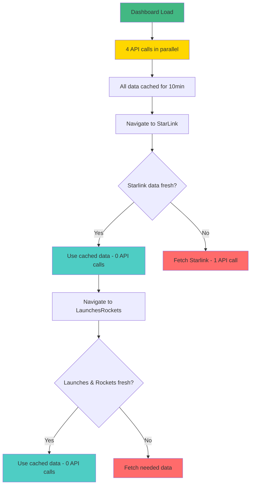
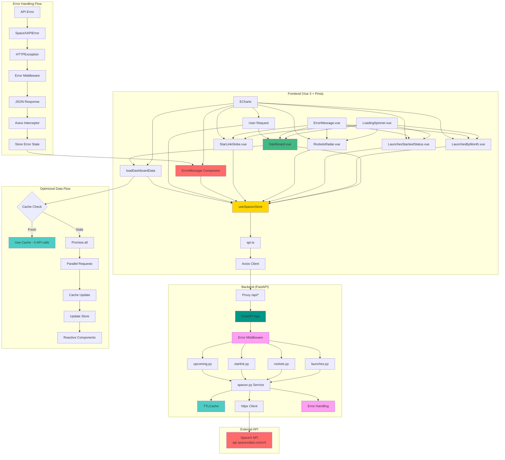

# SpaceX Dashboard

An interactive dashboard that displays SpaceX data including launches, rockets, and Starlink satellites, with real-time visualizations using Vue 3, TypeScript, and ECharts.

## 🚀 Features

- **Main Dashboard**: Overview with key metrics and upcoming launches
- **Launches**: Charts of launches by month, year, and status with filtering
- **Rockets**: Radar visualization of rocket characteristics
- **Starlink**: Interactive 3D globe showing satellites in orbit
- **Landing Analytics**: Donut chart showing landing success rates by year
- **Launch Timeline**: Visual timeline of Starlink launches
- **Custom Theme**: Dark design with vibrant SpaceX-style colors
- **Responsive Navigation**: Mobile-friendly navbar with active route highlighting
- **Custom UI Components**: SpaceX-styled date inputs and filters
- **Responsive**: Works on desktop and mobile
- **Smart Cache**: Performance optimization with 10-minute cache
- **Global State**: Efficient state management with Pinia
- **Error Handling**: Robust error handling system for frontend/backend
- **Loading States**: Granular loading states by data type
- **Optimized Navigation**: Smart loading without unnecessary calls

## 🛠️ Technologies

### Frontend

- **Vue 3** with Composition API
- **TypeScript** for static typing
- **Vite** as bundler
- **Vue Router** for navigation
- **Pinia** for state management
- **ECharts** for visualizations
- **D3.js** for data manipulation
- **Three.js** for 3D graphics
- **Three Globe** for 3D globe visualization
- **Lucide Vue Next** for icons
- **Axios** for HTTP requests

### Backend

- **FastAPI** as web framework
- **Python 3.13+** (required)
- **httpx** for asynchronous HTTP requests
- **cachetools** for TTL cache
- **CORS** configured for development
- **Structured logging** for debugging
- **Global middleware** for error handling
- **Configurable timeout** (30 seconds)

## 📋 Prerequisites

Before starting, make sure you have installed:

- **Node.js** (version 18 or higher)
- **Python 3.13 or higher** ⚠️ **IMPORTANT**: Python 3.13+ is required for proper backend functionality
- **npm** or **yarn** (Node.js package manager)
- **pip** (Python package manager)

## 🚀 Installation and Setup

### 1. Clone the repository

```bash
git clone <repository-url>
cd spacex-dashboard
```

### 2. Setup the Backend

```bash
# Navigate to the backend directory
cd backend

# Verify Python version (must be 3.13+)
python --version

# Create a virtual environment (recommended)
python -m venv venv

# Activate the virtual environment
# On Windows:
venv\Scripts\activate
# On macOS/Linux:
source venv/bin/activate

# Install dependencies
pip install -r requirements.txt

# Run the development server
uvicorn app.main:app --reload --host 0.0.0.0 --port 8000
```

The backend will be available at: `http://localhost:8000`

### 3. Setup the Frontend

```bash
# In a new terminal, navigate to the frontend directory
cd frontend

# Install dependencies
npm install

# Run the development server
npm run dev
```

The frontend will be available at: `http://localhost:5173`

## 🛡️ Error Handling System

The project implements a robust error handling system for both frontend and backend, providing a smooth user experience and efficient debugging.

### 🎨 UI Components for Errors

#### LoadingSpinner.vue

```vue
<!-- Loading component with multiple sizes and customizable messages -->
<LoadingSpinner :message="loadingMessage" size="large" :full-screen="true" />
```

**Features:**

- ✅ **3 sizes**: small, medium, large
- ✅ **Optional full-screen mode**
- ✅ **Contextual messages** by load type
- ✅ **SpaceX-style animation** with multiple rings
- ✅ **Corporate colors** (#ffffff, #00d4ff, #ff6b35)

#### ErrorMessage.vue

```vue
<!-- Error component with expandable technical details -->
<ErrorMessage
  :title="errorTitle"
  :message="errorMessage"
  :details="errorDetails"
  :full-screen="true"
  :show-retry="true"
  @retry="retryLoad"
/>
```

**Features:**

- ✅ **User-friendly messages** for users
- ✅ **Expandable technical details** for developers
- ✅ **Action buttons** (Retry, Reload page)
- ✅ **Specific error codes**
- ✅ **Timestamps** for tracking

### 🔧 Enhanced Pinia Store

#### Individual States by Data Type

```typescript
// Granular loading states
const loadingStates = ref<Record<string, LoadingState>>({
  launches: { isLoading: false, loadingMessage: "Loading launches..." },
  rockets: { isLoading: false, loadingMessage: "Loading rockets..." },
  starlink: {
    isLoading: false,
    loadingMessage: "Loading Starlink satellites...",
  },
  upcomingLaunches: {
    isLoading: false,
    loadingMessage: "Loading upcoming launches...",
  },
});

// Individual error states
const errors = ref<Record<string, ApiError | null>>({
  launches: null,
  rockets: null,
  starlink: null,
  upcomingLaunches: null,
});
```

#### Smart Error Handling

```typescript
const createApiError = (err: any, context: string): ApiError => {
  let message = "Unknown error";
  let code = "UNKNOWN_ERROR";

  if (err?.response) {
    // Specific HTTP errors
    switch (err.response.status) {
      case 400:
        message = "Invalid request";
        break;
      case 404:
        message = "Resource not found";
        break;
      case 429:
        message = "Too many requests. Try again later";
        break;
      case 500:
        message = "Internal server error";
        break;
      // ... more cases
    }
  } else if (err?.request) {
    // Network errors
    message = "Connection error. Check your internet connection";
    code = "NETWORK_ERROR";
  }

  return {
    message: `${message} (${context})`,
    code,
    details: err.response?.data,
    timestamp: new Date(),
  };
};
```

### 🌐 Axios Interceptors

#### Global HTTP Error Handling

```typescript
// Response interceptor with smart handling
api.interceptors.response.use(
  (response) => response,
  (error) => {
    // Specific handling by HTTP code
    const status = error.response?.status;
    let userMessage = "Unknown error";

    switch (status) {
      case 400:
        userMessage = "Invalid request";
        break;
      case 401:
        userMessage = "Unauthorized";
        break;
      case 403:
        userMessage = "Access denied";
        break;
      case 404:
        userMessage = "Resource not found";
        break;
      case 429:
        userMessage = "Too many requests. Try again later";
        break;
      case 500:
        userMessage = "Internal server error";
        break;
      case 502:
        userMessage = "Service unavailable";
        break;
      case 503:
        userMessage = "Service temporarily unavailable";
        break;
    }

    return Promise.reject({
      ...error,
      message: userMessage,
      code: `HTTP_${status}`,
      originalStatus: status,
      originalData: error.response?.data,
    });
  }
);
```

**Features:**

- ✅ **30-second timeout** configurable
- ✅ **Specific messages** by HTTP code
- ✅ **Network error handling** (no server response)
- ✅ **Automatic logging** of requests and errors
- ✅ **Enhanced errors** with additional context

### 🚀 Enhanced FastAPI Backend

#### Custom SpaceXAPIError Class

```python
class SpaceXAPIError(Exception):
    """Custom exception for SpaceX API errors"""
    def __init__(self, message: str, status_code: int = None, details: dict = None):
        self.message = message
        self.status_code = status_code
        self.details = details or {}
        super().__init__(self.message)
```

#### Robust Error Handling in Services

```python
async def fetch(path: str):
    """Improved function with robust error handling"""
    try:
        async with httpx.AsyncClient(timeout=30.0) as client:
            resp = await client.get(f"{BASE}/{path}")

            if resp.status_code == 200:
                data = resp.json()
                cache[key] = data
                return data
            elif resp.status_code == 404:
                raise SpaceXAPIError(
                    message=f"Resource not found: {path}",
                    status_code=404,
                    details={"path": path, "api_response": resp.text}
                )
            elif resp.status_code == 429:
                raise SpaceXAPIError(
                    message="Too many requests to the SpaceX API. Try again later.",
                    status_code=429,
                    details={"path": path, "retry_after": resp.headers.get("Retry-After")}
                )
            # ... more specific cases

    except httpx.TimeoutException:
        raise SpaceXAPIError(
            message="Timeout of connection with the SpaceX API",
            status_code=408,
            details={"path": path, "timeout": "30s"}
        )
    except httpx.ConnectError:
        raise SpaceXAPIError(
            message="Error of connection with the SpaceX API",
            status_code=503,
            details={"path": path}
        )
```

#### Global Error Handling Middleware

```python
@app.middleware("http")
async def error_handling_middleware(request: Request, call_next):
    start_time = time.time()

    try:
        response = await call_next(request)
        # Log successful requests
        process_time = time.time() - start_time
        logger.info(f"Request successful: {request.method} {request.url.path} - {response.status_code} - {process_time:.3f}s")
        return response

    except HTTPException as e:
        # Handle FastAPI HTTPExceptions
        return JSONResponse(
            status_code=e.status_code,
            content={
                "error": True,
                "message": e.detail.get("message", str(e.detail)),
                "details": e.detail.get("details", {}),
                "timestamp": e.detail.get("timestamp", time.time()),
                "path": request.url.path,
                "method": request.method
            }
        )

    except RequestValidationError as e:
        # Handle validation errors
        return JSONResponse(
            status_code=422,
            content={
                "error": True,
                "message": "Request validation error",
                "details": e.errors(),
                "timestamp": time.time(),
                "path": request.url.path,
                "method": request.method
            }
        )

    except Exception as e:
        # Handle unexpected errors
        return JSONResponse(
            status_code=500,
            content={
                "error": True,
                "message": "Internal server error",
                "details": {"error": str(e)},
                "timestamp": time.time(),
                "path": request.url.path,
                "method": request.method
            }
        )
```

**Backend Features:**

- ✅ **30-second timeout** for requests to SpaceX API
- ✅ **Specific handling** of HTTP codes (404, 429, 5xx)
- ✅ **Smart rate limiting** with retry-after
- ✅ **Connection and timeout errors** handled
- ✅ **Detailed logging** with timestamps and performance
- ✅ **Global middleware** that captures all errors
- ✅ **Structured responses** with complete context

### 📱 Integration in Views

#### Dashboard.vue with Granular States

```vue
<template>
  <main class="dashboard">
    <!-- Loading State -->
    <div v-if="isAnyLoading" class="loading-container">
      <LoadingSpinner
        :message="loadingMessage"
        size="large"
        :full-screen="true"
      />
    </div>

    <!-- Error State -->
    <div v-else-if="hasAnyError" class="error-container">
      <ErrorMessage
        :title="errorTitle"
        :message="errorMessage"
        :details="errorDetails"
        :full-screen="true"
        :show-retry="true"
        @retry="retryLoad"
      />
    </div>

    <!-- Main Content -->
    <div v-else class="dashboard-content">
      <!-- Dashboard content -->
    </div>
  </main>
</template>

<script setup lang="ts">
// Enhanced loading and error states
const isAnyLoading = computed(() => {
  const states = spacexStore.loadingStates;
  return (
    states.launches.isLoading ||
    states.rockets.isLoading ||
    states.starlink.isLoading ||
    states.upcomingLaunches.isLoading
  );
});

const loadingMessage = computed(() => {
  const states = spacexStore.loadingStates;
  if (states.launches.isLoading) return states.launches.loadingMessage;
  if (states.rockets.isLoading) return states.rockets.loadingMessage;
  if (states.starlink.isLoading) return states.starlink.loadingMessage;
  if (states.upcomingLaunches.isLoading)
    return states.upcomingLaunches.loadingMessage;
  return "Loading dashboard data...";
});

const hasAnyError = computed(() => {
  const errors = spacexStore.errors;
  return (
    errors.launches ||
    errors.rockets ||
    errors.starlink ||
    errors.upcomingLaunches
  );
});

const errorTitle = computed(() => {
  const errors = spacexStore.errors;
  if (errors.launches) return "Error loading launches";
  if (errors.rockets) return "Error loading rockets";
  if (errors.starlink) return "Error loading Starlink";
  if (errors.upcomingLaunches) return "Error loading upcoming launches";
  return "Error loading dashboard";
});

const errorMessage = computed(() => {
  const errors = spacexStore.errors;
  if (errors.launches) return errors.launches.message;
  if (errors.rockets) return errors.rockets.message;
  if (errors.starlink) return errors.starlink.message;
  if (errors.upcomingLaunches) return errors.upcomingLaunches.message;
  return "Unknown error";
});

const errorDetails = computed(() => {
  const errors = spacexStore.errors;
  const error =
    errors.launches ||
    errors.rockets ||
    errors.starlink ||
    errors.upcomingLaunches;
  return error ? JSON.stringify(error.details, null, 2) : "";
});
</script>
```

### 🎯 Benefits of the Error Handling System

#### 1. Enhanced User Experience

- ✅ **Clear and friendly messages** in Spanish/English
- ✅ **Informative and contextual loading states**
- ✅ **Recovery options** (retry button)
- ✅ **Professional visual feedback** with SpaceX-style components

#### 2. Debugging and Maintenance

- ✅ **Detailed logging** in backend and frontend
- ✅ **Expandable technical details** for developers
- ✅ **Timestamps** for error tracking
- ✅ **Specific and categorized error codes**
- ✅ **Complete context** in each error

#### 3. System Robustness

- ✅ **Timeout handling** (30 seconds)
- ✅ **Network error recovery**
- ✅ **Smart rate limiting** with retry-after
- ✅ **Appropriate fallbacks** for each error type
- ✅ **Request and response validation**

#### 4. Optimized Performance

- ✅ **Granular loading states** by data type
- ✅ **Smart cache** with error handling
- ✅ **Parallel loading** with individual error handling
- ✅ **Smooth navigation** without error interruptions

## 🧠 Optimized Pinia Store

### Smart Cache and Efficient Loading

The store has been completely optimized to avoid unnecessary calls and provide a smooth navigation experience.

#### Individual States by Data Type

```typescript
// Individual cache with timestamps
const lastFetchLaunches = ref<Date | null>(null);
const lastFetchRockets = ref<Date | null>(null);
const lastFetchStarlink = ref<Date | null>(null);
const lastFetchUpcomingLaunches = ref<Date | null>(null);

const CACHE_DURATION = 10 * 60 * 1000; // 10 minutes

// Computed properties to verify cache
const isLaunchesOutdated = computed(() => {
  if (!lastFetchLaunches.value) return true;
  return Date.now() - lastFetchLaunches.value.getTime() > CACHE_DURATION;
});
```

#### Optimized Helper Functions

```typescript
// Smart loading of only necessary data
const loadDashboardData = async () => {
  const promises = [];

  // Only load if outdated or empty
  if (isLaunchesOutdated.value || launches.value.length === 0) {
    promises.push(fetchLaunches());
  }
  if (isRocketsOutdated.value || rockets.value.length === 0) {
    promises.push(fetchRockets());
  }
  if (isStarlinkOutdated.value || starlink.value.length === 0) {
    promises.push(fetchStarlink());
  }
  if (isUpcomingLaunchesOutdated.value || upcomingLaunches.value.length === 0) {
    promises.push(fetchUpcomingLaunches());
  }

  if (promises.length > 0) {
    await Promise.all(promises);
  }
};

const loadLaunchesRocketsData = async () => {
  const promises = [];

  if (isLaunchesOutdated.value || launches.value.length === 0) {
    promises.push(fetchLaunches());
  }
  if (isRocketsOutdated.value || rockets.value.length === 0) {
    promises.push(fetchRockets());
  }

  if (promises.length > 0) {
    await Promise.all(promises);
  }
};

const loadStarlinkData = async () => {
  if (isStarlinkOutdated.value || starlink.value.length === 0) {
    await fetchStarlink();
  }
};
```

#### Double Cache Verification

```typescript
const fetchStarlink = async () => {
  // ✅ Verification 1: Time cache (10 minutes)
  // ✅ Verification 2: Data exists
  if (!isStarlinkOutdated.value && starlink.value.length > 0) {
    return starlink.value; // ❌ NO API call - returns cache
  }

  // Only reaches here if it really needs to load
  setLoading("starlink", true);
  clearError("starlink");

  try {
    const data = await getStarlink();
    starlink.value = data;
    lastFetchStarlink.value = new Date();
    clearError("starlink");
    return data;
  } catch (err) {
    const apiError = createApiError(err, "Starlink satellites");
    setError("starlink", apiError);
    throw apiError;
  } finally {
    setLoading("starlink", false);
  }
};
```

## 🚀 Optimized Navigation Flow

### Real Scenario: Dashboard → StarLink → LaunchesRockets



### Detailed Performance

#### 1. Initial Load (Dashboard)

```typescript
// Dashboard loads EVERYTHING in parallel
await Promise.all([
  spacexStore.fetchLaunches(), // ✅ API call
  spacexStore.fetchRockets(), // ✅ API call
  spacexStore.fetchStarlink(), // ✅ API call
  spacexStore.fetchUpcomingLaunches(), // ✅ API call
]);
// Total: 4 API calls
```

#### 2. Navigation to StarLink.vue

```typescript
// StarLink only checks if it needs to load Starlink
const loadStarlinkData = async () => {
  if (isStarlinkOutdated.value || starlink.value.length === 0) {
    await fetchStarlink(); // ❌ NOT executed - data already in cache
  }
};
// Total: 0 API calls
```

#### 3. Navigation to LaunchesRockets.vue

```typescript
// LaunchesRockets checks launches and rockets
const loadLaunchesRocketsData = async () => {
  const promises = [];

  if (isLaunchesOutdated.value || launches.value.length === 0) {
    promises.push(fetchLaunches()); // ❌ NOT executed - data already in cache
  }
  if (isRocketsOutdated.value || rockets.value.length === 0) {
    promises.push(fetchRockets()); // ❌ NOT executed - data already in cache
  }

  if (promises.length > 0) {
    await Promise.all(promises); // ❌ NOT executed - empty array
  }
};
// Total: 0 API calls
```

### Benefits of the Optimized System

#### ✅ Maximum Performance

- **Dashboard**: 4 parallel calls (initial load)
- **StarLink**: 0 calls (uses cache)
- **LaunchesRockets**: 0 calls (uses cache)
- **Total**: Only 4 initial calls

#### ✅ Smart Cache

- **Duration**: 10 minutes per data type
- **Double verification**: Time + data existence
- **Granular**: Each data type has its own cache

#### ✅ Granular States

- **Individual loading**: By data type
- **Individual errors**: By data type
- **Contextual messages**: Specific per operation

#### ✅ User Experience

- **Instant navigation**: Without unnecessary delays
- **Informative states**: User knows what's loading
- **Error recovery**: Functional retry buttons

### Verification in DevTools

To verify the optimized behavior:

1. **Open Network tab** in DevTools
2. **Load Dashboard** → You'll see 4 API calls
3. **Navigate to StarLink** → You'll see NO new calls
4. **Navigate to LaunchesRockets** → You'll see NO new calls
5. **Wait 10+ minutes and navigate** → You'll see new calls (cache expired)

## 🏗️ Project Architecture

### Data Flow

The project follows a **Backend for Frontend (BFF)** architecture with the following layers:

1. **Frontend (Vue 3 + Pinia)**: Reactive user interface
2. **Backend (FastAPI)**: Intermediate API with cache
3. **SpaceX API**: External data source

### Frontend-Backend Connection

#### Proxy Configuration (Vite)

```typescript
// vite.config.ts
export default defineConfig({
  server: {
    proxy: {
      "/api": "http://localhost:8000", // Redirects /api/* to backend
    },
  },
});
```

#### HTTP Client (Frontend)

```typescript
// frontend/src/api.ts
export const api = axios.create({ baseURL: "/api" });
export const getLaunches = () => api.get("/launches").then((res) => res.data);
```

#### Backend Endpoints

```python
# backend/app/main.py
app.include_router(launches.router, prefix="/api/launches", tags=["launches"])
app.include_router(rockets.router, prefix="/api/rockets", tags=["rockets"])
app.include_router(starlink.router, prefix="/api/starlink", tags=["starlink"])
```

### State Management (Pinia)

#### Main Store

```typescript
// frontend/src/stores/useSpacexStore.ts
export const useSpacexStore = defineStore("spacex", () => {
  const launches = ref<any[]>([]);
  const rockets = ref<any[]>([]);
  const starlink = ref<any[]>([]);

  // Individual cache by data type
  const lastFetchLaunches = ref<Date | null>(null);
  const lastFetchRockets = ref<Date | null>(null);
  const lastFetchStarlink = ref<Date | null>(null);

  // Function to load all data
  const fetchAllData = async () => {
    const [launchesData, rocketsData, starlinkData] = await Promise.all([
      getLaunches(),
      getRockets(),
      getStarlink(),
    ]);
    // Update state...
  };
});
```

#### Initialization in Dashboard

```typescript
// frontend/src/views/Dashboard.vue
onMounted(async () => {
  await spacexStore.fetchAllData(); // Loads all data at once
});
```

### Backend Cache

#### SpaceX Service

```python
# backend/app/services/spacex.py
from cachetools import TTLCache

cache = TTLCache(maxsize=8, ttl=600)  # 10-minute cache

async def fetch(path: str):
    key = f"spacex:{path}"
    if key in cache:
        return cache[key]  # Returns cached data

    # If not in cache, makes request to SpaceX API
    async with httpx.AsyncClient(timeout=15) as client:
        resp = await client.get(f"{BASE}/{path}")
        data = resp.json()
        cache[key] = data  # Saves to cache
        return data
```

## 📁 Project Structure

```
spacex-dashboard/
├── backend/
│   ├── app/
│   │   ├── api/           # API endpoints
│   │   │   ├── launches.py
│   │   │   ├── rockets.py
│   │   │   ├── starlink.py
│   │   │   └── upcoming.py
│   │   ├── services/      # Business logic
│   │   │   └── spacex.py  # Service with robust error handling
│   │   └── main.py        # FastAPI configuration + Global middleware
│   └── requirements.txt   # Python dependencies
├── frontend/
│   ├── src/
│   │   ├── components/    # Vue components
│   │   │   ├── charts/    # Charts and visualizations
│   │   │   │   ├── LandingSuccessDonutChart.vue
│   │   │   │   ├── LaunchesByMonth.vue
│   │   │   │   ├── LaunchesByYearChart.vue
│   │   │   │   ├── LaunchesStackedStatus.vue
│   │   │   │   ├── RocketsRadar.vue
│   │   │   │   └── StarlinkLaunchTimelineSimple.vue
│   │   │   ├── layout/    # Layout and navigation
│   │   │   │   ├── AppShell.vue
│   │   │   │   └── Navbar.vue
│   │   │   ├── ui/        # Reusable UI components
│   │   │   │   ├── ErrorMessage.vue
│   │   │   │   ├── LoadingSpinner.vue
│   │   │   │   ├── SpaceXDateInput.vue
│   │   │   │   └── SpaceXFilter.vue
│   │   │   ├── examples/  # Example components
│   │   │   │   └── ThemeUsageExample.vue
│   │   │   ├── cards/     # Card components
│   │   │   │   └── KPICard.vue
│   │   │   ├── tables/    # Table components
│   │   │   │   └── UpcomingLaunchesTable.vue
│   │   │   └── starlink/   # 3D component
│   │   │       └── StarLinkGlobe.vue
│   │   ├── views/          # Main pages
│   │   │   ├── Dashboard.vue       # Main view with error handling
│   │   │   ├── LaunchesRockets.vue # View with granular states
│   │   │   └── StarLink.vue        # Optimized view
│   │   ├── stores/         # Global state (Pinia)
│   │   │   └── useSpacexStore.ts   # Optimized store with smart cache
│   │   ├── assets/         # Static resources
│   │   │   ├── theme.ts            # Custom SpaceX-style theme
│   │   │   └── base.css
│   │   ├── router/         # Route configuration
│   │   │   └── index.ts
│   │   ├── api.ts          # HTTP client (Axios) with interceptors
│   │   ├── main.ts         # Entry point
│   │   └── App.vue         # Root component
│   ├── package.json        # Node.js dependencies
│   └── vite.config.ts      # Vite configuration + Proxy
└── README.md
```

## 🔧 Available Scripts

### Frontend

```bash
npm run dev      # Development server
npm run build    # Production build
npm run preview  # Build preview
```

### Backend

```bash
uvicorn app.main:app --reload    # Development server
uvicorn app.main:app --host 0.0.0.0 --port 8000  # Server on specific port
```

## 🌐 API Endpoints

### 📖 Interactive API Documentation

**Live API Documentation:**

- 🚀 **[Swagger UI (Interactive)](https://spacex-dashboard-api.onrender.com/docs)** - Try out the API endpoints directly in your browser
- 📚 **[ReDoc (Alternative)](https://spacex-dashboard-api.onrender.com/redoc)** - Clean, readable documentation format
- 🔧 **[OpenAPI Schema](https://spacex-dashboard-api.onrender.com/openapi.json)** - Raw OpenAPI specification

### Backend (FastAPI)

| Endpoint                 | Method | Description              | Parameters                          |
| ------------------------ | ------ | ------------------------ | ----------------------------------- |
| `/api/launches`          | GET    | List of launches         | `success` (bool), `rocket` (string) |
| `/api/rockets`           | GET    | Rocket information       | -                                   |
| `/api/starlink`          | GET    | Starlink satellite data  | -                                   |
| `/api/launches/upcoming` | GET    | Upcoming launches        | -                                   |
| `/health`                | GET    | Service health check     | -                                   |
| `/docs`                  | GET    | Swagger UI documentation | -                                   |
| `/redoc`                 | GET    | ReDoc documentation      | -                                   |

### 🎯 API Features

- **🔄 Smart Caching**: 10-minute TTL cache for optimal performance
- **🌐 CORS Enabled**: Configured for frontend integration
- **⚡ Rate Limiting**: Automatic handling of SpaceX API rate limits
- **🛡️ Error Handling**: Robust error responses with detailed messages
- **📊 Structured Logging**: Complete request/response logging
- **🔧 Type Safety**: Full TypeScript-like typing with Pydantic models

### Usage Examples

```bash
# Production API
https://spacex-dashboard-api.onrender.com/api/launches

# Development API
http://localhost:8000/api/launches

# Get only successful launches
GET /api/launches?success=true

# Get launches from a specific rocket
GET /api/launches?rocket=falcon9

# Get upcoming launches
GET /api/launches/upcoming

# Health check
GET /health
```

### 🔧 API Configuration

**Cache Settings:**

- **TTL**: 10 minutes (600 seconds)
- **Max Size**: 8 endpoints
- **Policy**: LRU (Least Recently Used)

**CORS Origins:**

- Production: `https://spacex-dashboard-project-*.vercel.app`
- Development: `http://localhost:5173`

## 🎨 Theme Customization

The theme is located in `frontend/src/assets/theme.ts` and includes:

- **Color palette**: 7 vibrant colors (#ff58b0, #ff83c4, #7c4dff, etc.)
- **ECharts configuration**: Styles for charts
- **Text colors**: For different UI elements
- **Grid configuration**: Margins and spacing
- **Tooltips**: Custom styles with blur and rounded borders

To modify the theme, edit the `theme.ts` file and changes will be applied automatically.

## 🎨 Additional Components

### New Chart Components

#### LandingSuccessDonutChart.vue

- **Purpose**: Displays landing success rate as an interactive donut chart
- **Features**: Year filtering, success rate statistics, visual indicators
- **Data**: Analyzes landing attempts and success rates by year

#### LaunchesByYearChart.vue

- **Purpose**: Shows launch frequency by year with rocket filtering
- **Features**: Rocket selection dropdown, year-based visualization
- **Data**: Displays launch counts per year for selected rockets

#### StarlinkLaunchTimelineSimple.vue

- **Purpose**: Simplified timeline view of Starlink launches
- **Features**: Clean timeline visualization, launch frequency analysis
- **Data**: Starlink launch timeline with date-based visualization

### New UI Components

#### SpaceXDateInput.vue

- **Purpose**: Custom date input with SpaceX styling
- **Features**: Label support, min/max date validation, SpaceX theme integration
- **Usage**: Consistent date selection across the application

#### SpaceXFilter.vue

- **Purpose**: Custom filter dropdown with SpaceX styling
- **Features**: Dynamic options, label support, theme integration
- **Usage**: Filtering data across different views

#### Navbar.vue

- **Purpose**: Main navigation bar with SpaceX branding
- **Features**: Responsive design, active route highlighting, logo integration
- **Usage**: Primary navigation component for the application

### Example Components

#### ThemeUsageExample.vue

- **Purpose**: Demonstrates how to use the SpaceX theme in components
- **Features**: Shows typography, colors, and styling examples
- **Usage**: Reference for developers implementing SpaceX styling

## 📊 Detailed Data Flow

### 1. Initialization

```
User accesses Dashboard → onMounted() → spacexStore.fetchAllData()
```

### 2. Data Loading

```
fetchAllData() → Promise.all([
  getLaunches(),    // GET /api/launches
  getRockets(),     // GET /api/rockets
  getStarlink()     // GET /api/starlink
])
```

### 3. Backend Cache

```
API Request → cache.check() →
  If exists: return cache[key]
  If not exists: SpaceX API → cache[key] = data → return data
```

### 4. Component Updates

```
Updated store → computed properties → watchers →
updateChart() → ECharts re-render
```

## 🤝 Troubleshooting

### Python Version Error

If you encounter errors related to Python version:

```bash
# Check current version
python --version

# If you have a version earlier than 3.13, update Python
# On macOS with Homebrew:
brew install python@3.13

# On Ubuntu/Debian:
sudo apt update
sudo apt install python3.13

# On Windows, download from python.org
```

### CORS Error

If you encounter CORS errors, verify that the backend is running on port 8000 and the frontend on port 5173.

### Dependency Error

```bash
# Clear npm cache
npm cache clean --force

# Reinstall dependencies
rm -rf node_modules package-lock.json
npm install
```

### Python Error

```bash
# Check Python version
python --version

# Reinstall dependencies
pip install --upgrade pip
pip install fastapi uvicorn httpx cachetools
```

## 📊 Data

Data comes from the [public SpaceX API](https://api.spacexdata.com/v4/) and updates automatically. The system includes:

- **Smart cache**: Reduces requests to external API (10 min TTL)
- **Error handling**: Fallbacks when API is unavailable
- **Real-time data**: Automatic updates every 10 minutes
- **Filtering**: Query parameters to filter launches

## 🤝 Contributing

1. Fork the project
2. Create a branch for your feature (`git checkout -b feature/AmazingFeature`)
3. Commit your changes (`git commit -m 'Add some AmazingFeature'`)
4. Push to the branch (`git push origin feature/AmazingFeature`)
5. Open a Pull Request

## 📝 License

This project is under the MIT License. See the `LICENSE` file for more details.

## 🙏 Acknowledgments

- [QuadSci](https://www.quadsci.ai/product/cohorts-ai) for giving me the opportunity to develop this challenge
- [SpaceX API](https://api.spacexdata.com/v4/) for providing the data
- [ECharts](https://echarts.apache.org/) for the visualizations
- [Vue.js](https://vuejs.org/) for the frontend framework
- [FastAPI](https://fastapi.tiangolo.com/) for the backend framework

## 🏗️ Architecture Diagram



### Data Flow Explained:

1. **User accesses Dashboard** → `onMounted()` is executed
2. **Store executes loadDashboardData()** → Verifies individual cache by type
3. **If cache is fresh** → Uses existing data (0 API calls)
4. **If cache is stale** → Makes parallel requests only for necessary data
5. **Backend receives requests** → Verifies cache (TTL 10 min)
6. **If no cache** → Makes request to SpaceX API with robust error handling
7. **Data is saved to cache** → Returned to frontend
8. **Store updates state** → Components re-render automatically
9. **ECharts updates charts** → User sees updated data

### Error Handling Flow:

1. **Error in SpaceX API** → Custom SpaceXAPIError
2. **Error propagated** → HTTPException with structured details
3. **Global middleware** → Captures and formats error response
4. **Axios interceptor** → Enhances error with additional context
5. **Store handles error** → Updates specific error state
6. **ErrorMessage component** → Shows friendly message + technical details
7. **User can retry** → Functional button that clears cache and retries

### Benefits of this Architecture:

- ✅ **Performance**: Smart cache reduces calls to SpaceX API
- ✅ **UX**: Single initial load, then instant data
- ✅ **Robustness**: Complete error handling at each layer
- ✅ **Debugging**: Detailed logging and expandable technical details
- ✅ **Scalability**: Backend can handle multiple frontends
- ✅ **Maintainability**: Clear separation of responsibilities
- ✅ **Optimized navigation**: 0 unnecessary calls between views
